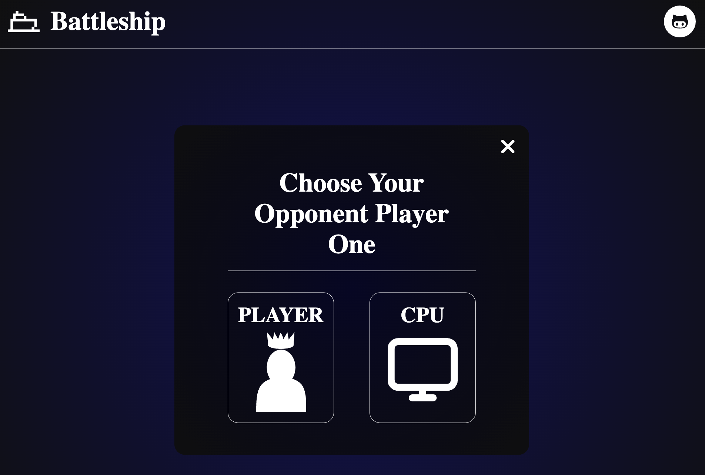
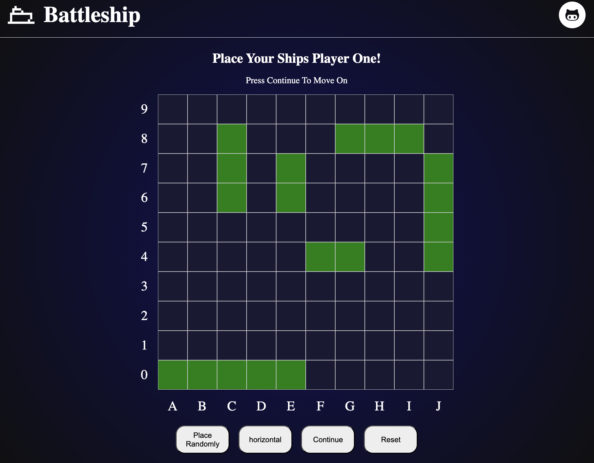
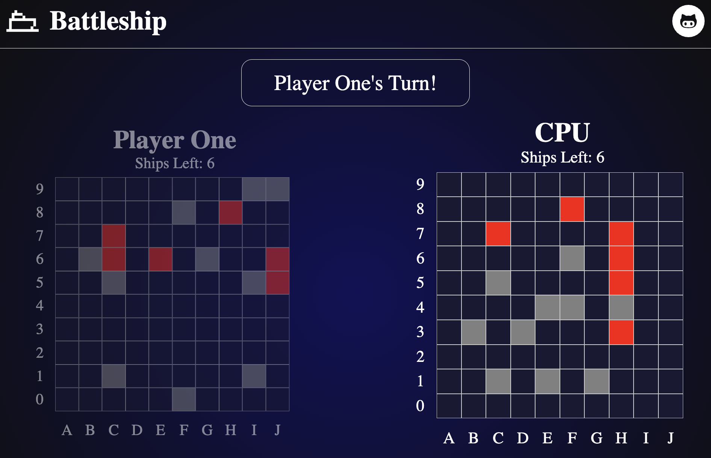

# Interactive Battleship Game
A turn based strategy game where users place their ships on a grid and attempt to sink their opponent's fleet before their own ships are sunk. Opponents' ships remain hidden, and the goal is to eliminate all of your opponents ships first.

## Purpose
This project was part of an online curriculum called Odin Project. The main goal was to practice test driven development (TDD) using Jest while improving my ability to write clean, modular, and well-structured code in real applications.

## Challenges 
The biggest challenge I faced during this project was designing the game using object-oriented programming principles. Deciding how to structure the code, what properties and methods each object should have, and how they should all interact with each other at scale was tricky. 

Separating DOM manipulation from core logic seemed simple and intuitive at first, but integrating the two together proved to be much more difficult once there were so many moving parts to manage.

## What I learned
Experimenting with Jest and TDD was a huge learning experience. Having clear requirements and writing tests before development gave my work structure and helped unnecessary code bloat. I also learned the importance of maintaining clean, modular code and practicing separation of concerns with real application.

As my project grew, my code inevitably became more complex and tightly coupled in certain areas. Despite that, it was still a significant improvement compared to my earlier work. My organization and structure were much cleaner, and I was able to clearly identify the areas where I struggled and need to work on. 

This project was a huge stepping stone in strengthening my understanding of object-oriented design / TDD and establishing a solid foundation to grow from in future projects. I'm looking forward to improving and applying what I learned.

## Built With
- JavaScript
- HTML5
- CSS3
- Jest
- Webpack

## Opponent Selection

## Game Setup

## Gameplay

